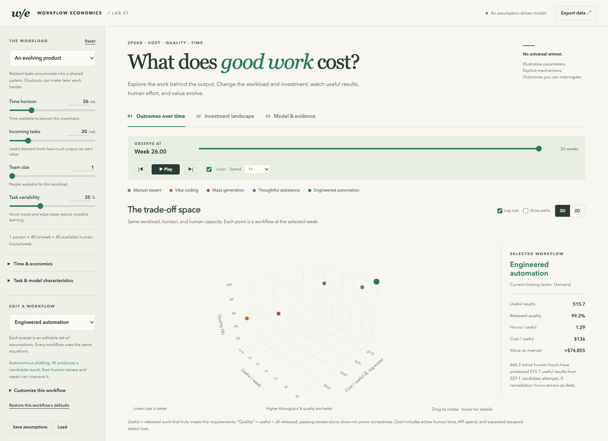
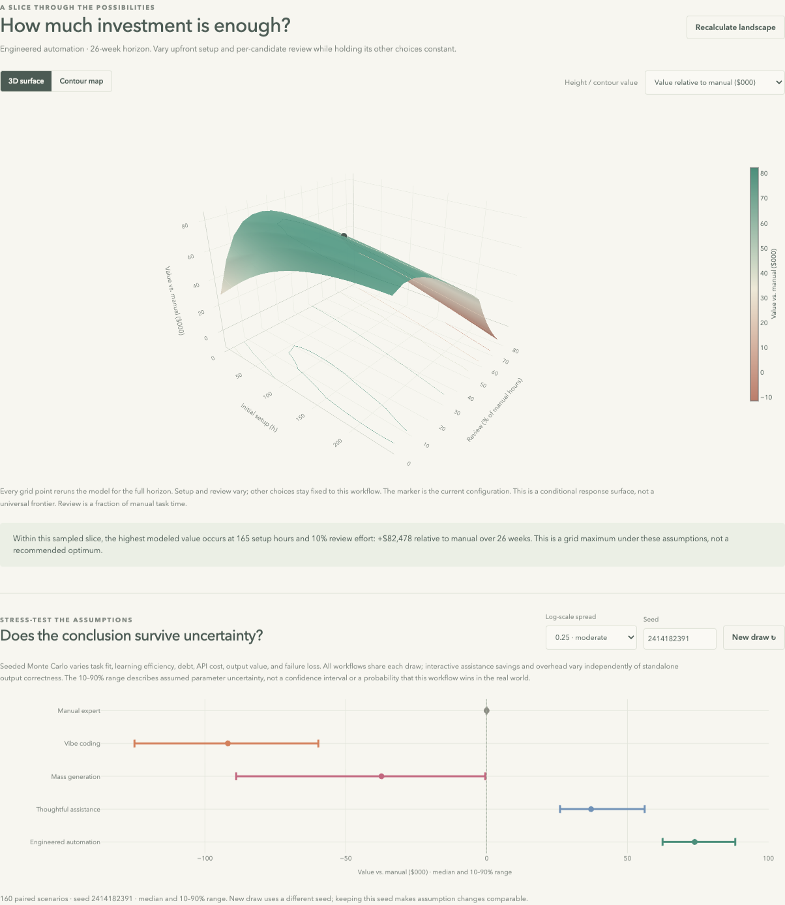

# Workflow Economics

**An interactive lab for thinking about AI workflows in shades of grey.**

[Open the live dashboard](https://maxim-mazurok.github.io/workflow-economics/) · [Watch the 23-minute walkthrough](https://maxim-mazurok.github.io/workflow-economics/video/workflow-economics-demo.mp4) · [Read the LinkedIn post](https://lnkd.in/p/gxN9Jw56) · [Explore the model](model.js)

AI conversations often collapse into “do lots of tasks quickly” versus “do the work well.” This dashboard explores the space between those positions: speed, cost, quality, human attention, and the investment needed to make automation useful over time.

Change the workload, team capacity, and workflow assumptions. Compare manual expert work, vibe coding, mass generation, thoughtful assistance, and engineered automation using the same underlying equations. These are editable starting points, not fixed rankings.

[](https://maxim-mazurok.github.io/workflow-economics/video/workflow-economics-demo.mp4)

*Click the dashboard preview to play the full walkthrough. The web-optimized MP4 is hosted with the project’s GitHub Release and served through GitHub Pages; it is kept out of Git history.*

## Explore

- **Outcomes over time:** rotate the 3D trade-off chart, switch to 2D, toggle log cost, and inspect trajectories. Play, pause, loop, scrub, or change playback speed. 3D interaction is disabled during playback; pause to rotate or inspect the chart.
- **Investment landscape:** vary setup and review effort to see the resulting surface. Automatically run 160 seeded, paired sensitivity scenarios; reuse the seed to reproduce a comparison.
- **Model & evidence:** inspect equations, change structural coefficients, read sources, and review the model’s limitations.
- **Save your work:** export results as CSV or save and reload assumptions, including the sensitivity seed.



## AI-generated, with human sample review

This project was generated using **GPT-6 Astra with extra-high reasoning in Codex**, across a few iterations with my sample review and feedback.

I’m pretty happy with the model overall. It could always be more detailed, and the presets and assumptions can change. Hopefully it’s useful for moving beyond the binary question of “is AI useful or not?” and toward which combination of human attention, automation, and investment fits a particular workload.

— Maxim Mazurok

Human sample review and automated checks do not establish empirical validity. Treat this as an inspectable scenario model, not a calibrated forecast or a benchmark of current AI products.

## What the model accounts for

Each workflow shares a recurring task stream and a pool of human capacity. Setup consumes time before production begins. Production, review, repair, tuning, and upkeep compete for the remaining human hours; machine latency, parallelism, and serial work impose separate limits.

Reusable capability and remediation debt evolve over time. Released work can be useful or defective. Rejected candidates return to the backlog. Expert-led assistance is modeled separately from autonomous drafting, so weak standalone AI output does not automatically imply weak interactive assistance. Direction and checking overhead can still outweigh time saved.

Useful output earns value, while active human time, API usage, and escaped defects incur costs. The manual comparator has the same workload, horizon, capacity, and economic assumptions. Comparing manual with itself returns zero.

- **Quality** means useful results divided by released results, not an arbitrary score for creativity.
- **Cost per useful result** includes all accumulated setup and operating costs. It is undefined before useful work exists.
- **Value relative to manual** is the difference in discounted economic surplus, not a percentage ROI or a promise of cash savings.
- **Uncertainty bands** show sensitivity to assumed parameter distributions, not confidence intervals or measured probabilities of real-world success.

The simulation tracks expected flows, so fractional task counts are intentional. Team capacity is pooled; it does not model individual schedules or coordination costs. Other omissions include delayed defect discovery, correlated failures, false-positive review, deadlines, catastrophic loss tails, and provider rate limits. Research motivates the mechanisms but does not calibrate the coefficients. See the dashboard’s **Model & evidence** tab for the equations, sources, and fuller limits.

Playback uses fixed axes and fades markers in after one expected useful result to keep early setup ratios from overwhelming the chart. Accounting still begins immediately. The optional cost transform is `log10(1 + dollars)` with dollar tick labels, so zero remains valid. Static views retain every defined value.

## Run locally

No package installation, API keys, or backend is required. Plotly is bundled, and calculations run in your browser. After downloading the repository you can open `index.html` directly, or serve it:

```sh
python3 -m http.server 8765
```

Then open <http://localhost:8765/>. No model inputs are sent to a server by the application.

## Check and build

With Node.js 24 or newer:

```sh
node model.test.js
node --check app.js
node scripts/build.mjs
```

The model tests cover accounting conservation, bounded probabilities, setup behavior, human and machine capacity, baseline identity, expert-led assistance, numerical convergence, seeded reproducibility, and interpolation. They validate implementation properties, not the truth of the chosen assumptions.

The build copies only the site assets and license notices into `dist/`. GitHub Actions checks the model and JavaScript, builds the static site, and deploys `main` to GitHub Pages. Pull requests run the checks without deploying.

## Files

| File | Purpose |
| --- | --- |
| `model.js` | Shared equations, workflow presets, scenarios, sampling, and uncertainty |
| `app.js` | Controls, chart rendering, playback, and import/export |
| `styles.css` / `index.html` | Interface and in-app model documentation |
| `model.test.js` | Numerical and behavioral checks |
| `scripts/build.mjs` | Static site packaging |
| `plotly.min.js` | Bundled Plotly.js 3.1.0 |

## License

Project code is available under the [MIT license](LICENSE). Plotly.js retains its own [MIT license](licenses/plotly.txt); see [third-party notices](THIRD_PARTY_NOTICES.md).
